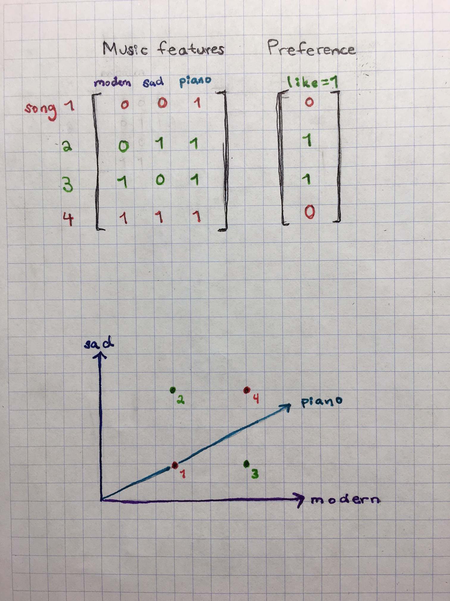
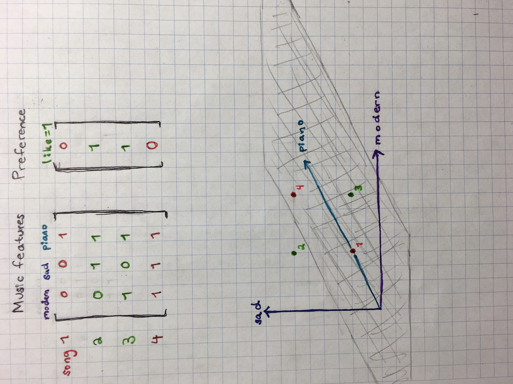

# Visualizing neurons from a neural network

What are neurons for a neural network?

To understand, we start with a [toy example][1]:

**Our objective is to correctly classify this data using linear planes**

We can reveal that this is challenging with this particular data set with the following plot:

In addition to the given input (axon), we will denote **`x`**, A neuron in a neural network is comprised of the following components:

* **`w`:** the weights or synapses (initially chosen) for each input to the neuron
* **`f`:** an activation function which is a function of `w` and `x`.
* **`o`:** the output of the neuron (i.e. output axon) which is sent on to one or more other neurons as an input axon.

It is helpful to understanding neurons by understanding their place in the larger picture of the network: The output axons of neurons in the final layer (or the first layer in our simplistic example) are passed a loss function. The loss calculated is then chained back through the network in order to determine how each set of weights to each neuron is impacting the loss. The weights are updated accordingly.

This process is represented in the following gif:

[1]: http://cs231n.github.io/neural-networks-1/
