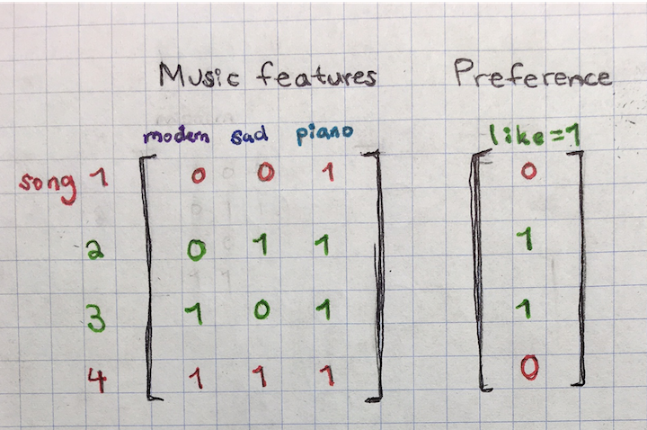
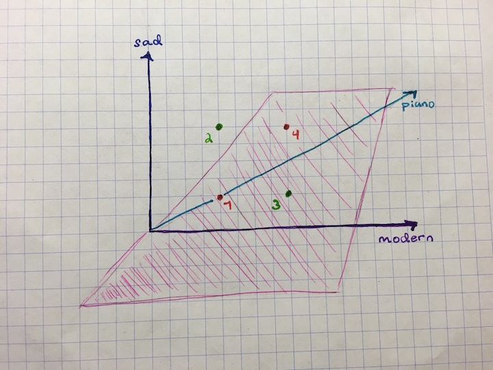
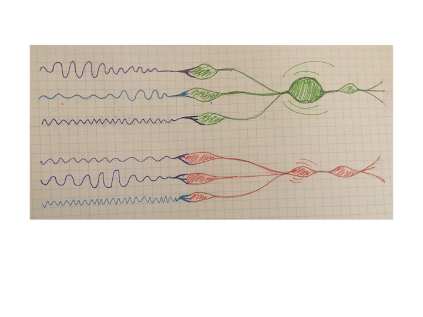
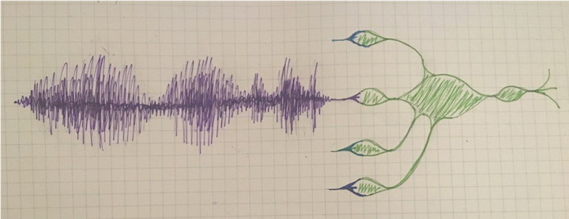

# Visualizing neurons from a neural network

What are neurons for a neural network?

To understand, we start with a [toy example][1]:



**Our objective is to correctly classify this data using linear planes**

We can reveal that this is challenging with this particular data set with the following plot:




In addition to the given input (axon), we will denote **`x`**, A neuron in a neural network is comprised of the following components:

* **`w`:** the weights or synapses (initially chosen) for each input to the neuron
* **`f`:** an activation function which is a function of `w` and `x`.
* **`o`:** the output of the neuron (i.e. output axon) which is sent on to one or more other neurons as an input axon.

It is helpful to understanding neurons by understanding their place in the larger picture of the network: The output axons of neurons in the final layer (or the first layer in our simplistic example) are passed a loss function. The loss calculated is then chained back through the network in order to determine how each set of weights to each neuron is impacting the loss. The weights are updated accordingly.

This process is represented in the following gif:


Or the coded version:

```python
# Single neuron as a linear classifier
import numpy as np
import matplotlib.mlab as mlab
import matplotlib.pyplot as plt

# Simulate X and Y
# XOR pattern
X = np.array([[0,0,1],[0,1,1],[1,0,1],[1,1,1]])
Y = np.array([[0,1,1,0]]).T

# Initial weights, a set for class 0 and a set for class 1
# W is dimension (dim of X x number of classes); an array of weights
# python does it cols x rows
# 1 - like a nnet with 1 neuron
W = 2*np.random.random((3,4)) - 1
loss_all = []

# Sigmoid activation function
for i in range(len(X)):
    obs = X[i,:]
    y_obs = Y[i]
    losses = []
    iters = 1000
    # first neuron's weights
    # we have four sets for future times where we have more than one neuron
    weights_neuron1 = W[:,0]
    for iter in range(iters):
        print 'starting iter: ' + str(iter)
        # calculate the input to the first neuron
        input_neuron1 = np.dot(weights_neuron1, obs) 
        # calculate activation function
        # sigmoid in this case
        f_neuron1 = 1/(1+np.exp(-input_neuron1))
        # this is the ouptput of the neuron
        # if y = 1, f_neuron is the correct probability
        # if y = 0, 1-f_neuron1 is the correct probability
        true_class_prob = f_neuron1 if y_obs == 1 else (1-f_neuron1)
        loss_neuron1 = 1 - true_class_prob
        losses.append(loss_neuron1)
        dLdF = 1 if y_obs == 1 else -1
        dL = loss_neuron1 * dLdF
        # the gradient for this neuron and this input
        dW = dL * f_neuron1 * (1 - f_neuron1)
        #weights_neuron1 += np.dot(obs, dW)
        weights_neuron1 += obs * dW
    loss_all.append(losses)


x = range(iters)
line = plt.plot(x, loss_all[0],  x, loss_all[1], x, loss_all[2], x, loss_all[3], linewidth=2)
plt.show()
```


## Other ideas for visualization






[1]: http://cs231n.github.io/neural-networks-1/
